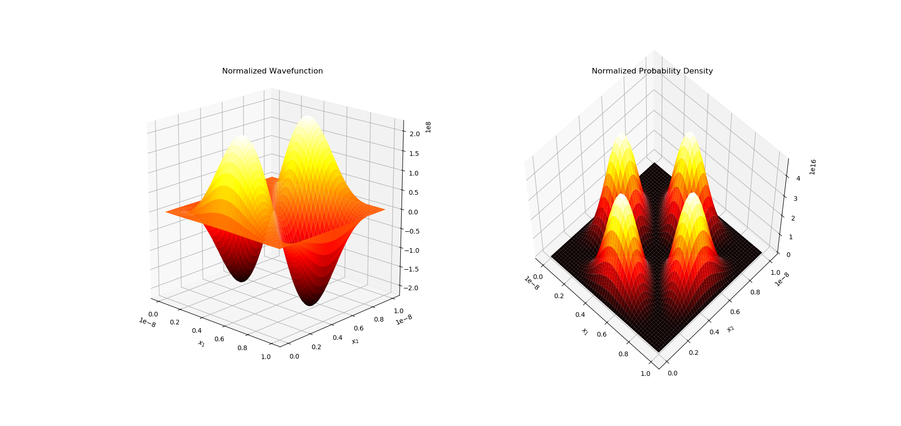
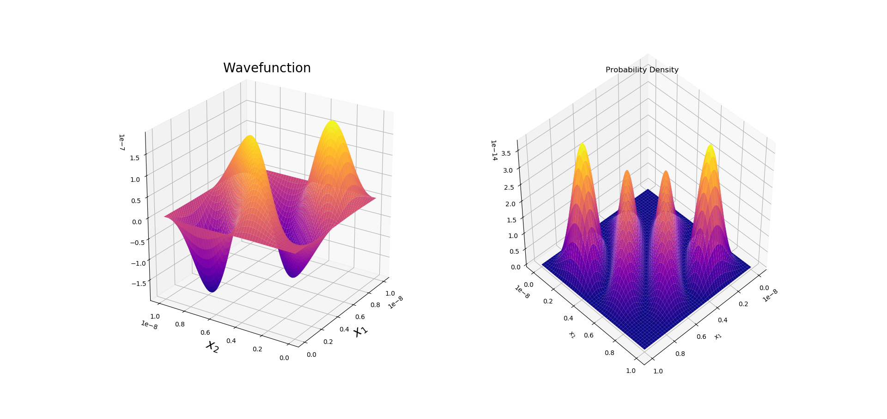

# Identical Particle Interaction using Perturbation Theory
We present numerically exact solutions for the time-independent Schrödinger equation of a system of two identical fermions confined in an infinite potential well that have the same charge and repel each other.

A method of finite differences is employed to solve the system of 2 identical fermions that don’t interact with each other to plot the wavefunction and probability density curves. Next, perturbation theory is applied to find the correction to the energies and wavefunctions in order to account for potential due to the repulsion between the two electrons in addition to the infinite potential well. 

  
 

    <em>Identical fermions (parallel spins) in first excited state in infinite potential well</em>

  
 

    <em>Interacting identical fermions (parallel spin) in ground state in an infinite well.</em>

<em> Project completed as part of the course 'Atomic & Molecular Physics' in my bachelor's. </em> 
